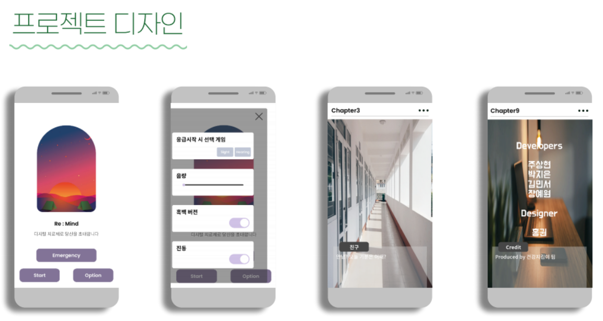
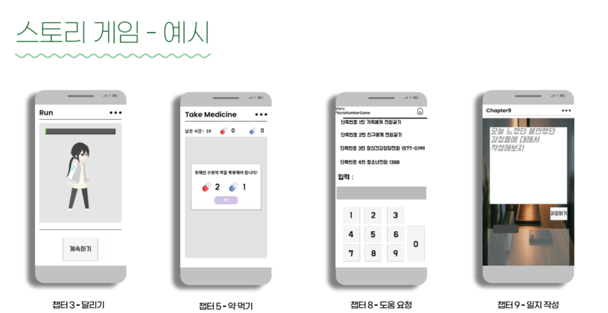

# Digital_Remedy
2022 소프트웨어중심대학 해커톤

### 팀명 : B1_건강지키미

### 1. 팀원 :

(1) 원광대학교 / 주상현 / 유형(개발자) / 리더

(2) 동명대학교 / 김민서 / 유형(개발자) / 영상제공

(3) 강원대학교 / 홍권 / 유형(디자이너) / 자료취합

(4) 경희대학교 / 장예원 / 유형(개발자) / 서버관리

(5) 이화여자대학교 / 박지은 / 유형(개발자) / 소통

### 2. 요약 :

공황장애 환자들을 위한 그라운딩 기술 치료 게임

### 3. 프로젝트 상세설명 :

- 디지털 치료제란?
    
    2019년 하반기부터 국내에서 주목받기 시작한 디지털치료제는 '질병을 예방·관리·치료하기 위해 환자에 대한치료제 개입(evidence-based therapeutic interventions)을 제공하는 소프트웨어 의료기기'로 정의하고 있습니다.
    
    이 아이디어에서는 현대인들이 가질 수있는 다양한 질병들을 갖고있는 사람들을 위해 효과적으로 증상을 치료할 수있도록 하는 소프트웨어 개발을 목적으로 하고 있습니다.
    
- 그라운딩 기술이란?
    
    플래시백, 괴로운 기억, 부정적인 정서 등 에서 빠져나오도록 도와주는 훈련으로 현재 사용자가 경험하고 있는 것에서 주의를 돌려 지금 이 순간 일어나고 있는 일들로 초점을 변경할 수 있도록 도와줍니다.
    

### 4. 기능 구현 :

- 미니 게임
    - 시각 게임: 떨어지는 음식의 순서를 기억해서 맞추는 게임
    - 청각 게임: 무슨 소리인지 맞추는 게임
- 스토리 게임
    - 공황장애를 가진 주인공(학생)의 하루
    - 챕터 형식으로 되어있으며 챕터마다 미니 게임이 존재
    - 질환을 극복해나가는 스토리
    - 게임을 통해 질환에 대한 정보 제공

### 5. 스크린샷

